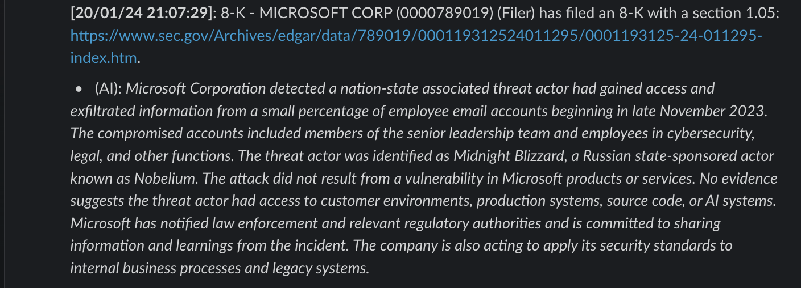

# SEC 8-K Filing Security Incident Summarizer

## Overview

This Python script automates the retrieval and summarization of security incident reports from the U.S. Securities and Exchange Commission's (SEC) RSS feed for 8-K filings.

The script retrieves all 8-K filings and detects whether any of the filings include an [item 1.05](https://www.sec.gov/news/press-release/2023-139).

The script then submits the item 1.05 text to a Slack Webhook with a link to the original 8-K filing.

Optionally, the script can use OpenAI's API to summarize the whole filing (which may contain an additional exhibit or statement) in order to summarize the report.

## Usage

Running the script is as simple as installing the dependencies and just running the Python script:

```bash
pip3 install feedparser beautifulsoup4 openai requests
USER_AGENT='Joshua Rogers Joshua@Joshua.hu' SLACK_WEBHOOK='https://hooks.slack.com/services/.....' OPENAI_KEY=sk-...... python3 ./sec-sec-incident-notifier.py
```

Each of those environmental values are optional, and they may also be set in the `sec-sec-incident-notifier.py` file instead.

|An example of the Slack output from this script.|
|:-:|


## Environmental Values

There are three optional environmental values. Optionally, these values can be set directly in the script itself.

- `OPENAI_KEY`: If set to a valid OpenAI API key, the script will attempt to summarize the 8-K filing.

- `SLACK_WEBHOOK`: If set to a valid Slack Webhook, the script will send a message containing the information of the filing to a Slack channel.

- `USER_AGENT`: The SEC requirs [progmatic downloads to use a specific format for the user agent](https://www.sec.gov/os/webmaster-faq#code-support). An example is `Sample Company Name AdminContact@<sample company domain>.com`. If this is not set, a default is used.

## Prerequisites
- Python 3.x
- `feedparser` library (`pip install feedparser`).
- `beautifulsoup4` library (`pip install beautifulsoup4`).
- `requests` library (`pip install requests`).
- `openai` library (`pip install openai`), if using OpenAI to summarize the filings.

## Notes
- The script runs indefinitely, periodically checking for updates based on the refresh interval (5-minutes).
- If an 8-K filing with an item 1.05 is found but the script cannot parse the details, it still reports the filing in the slack message.
- The script likely does not handle all error cases, as it was made in 15-minutes.

## Installation
In addition to running the script manually, a small debian-based installation script [install.sh](install.sh) is provided which when run as root, will install a systemd service to run the script in the background and log the output. The script is installed as `/usr/local/bin/sec-sec-incident-notifier.py`, logs are stored in `/var/log/sec-sec-incident-notifier.log` and `/var/log/sec-sec-incident-notifier-error.log`, and a logrotate configuration file is created in `/etc/logrotate.d/sec-sec-incident-notifier`.

The environmental values are also respected, if set:

```bash
$ sudo USER_AGENT='Joshua Rogers Joshua@Joshua.hu' SLACK_WEBHOOK='https://hooks.slack.com/services/.....' OPENAI_KEY=sk-...... ./install.sh"
sec-sec-incident-notifier has been installed in /usr/local/bin/sec-sec-incident-notifier.py with OPENAI_KEY=, SLACK_WEBHOOK_URL=, and USER_AGENT=, and a service has been installed in /etc/systemd/system/sec-sec-incident-notifier.service. The service is started and logging to /var/log/sec-sec-incident-notifier.log and /var/log/sec-sec-incident-notifier-error.log, and log rotation is set up in /etc/logrotate.d/sec-sec-incident-notifier.
```

## License
This project is licensed under [GPL3.0](/LICENSE).
